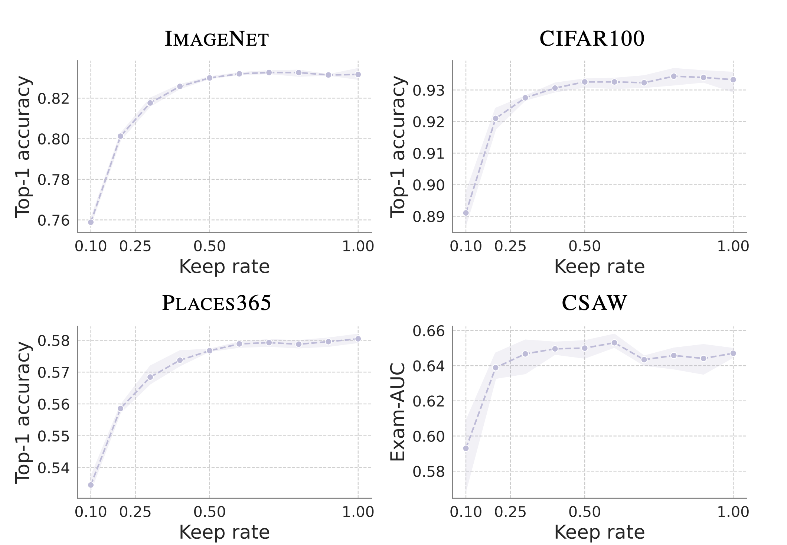
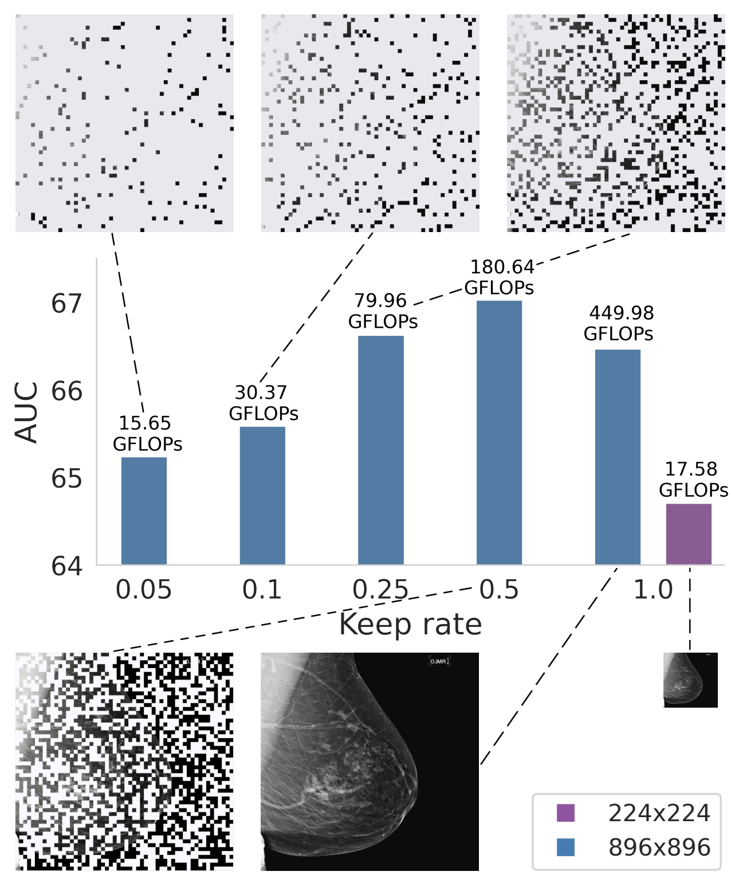

# PatchDropout: Economizing Vision Transformers Using Patch Dropout
***WACV 2023***

This is a PyTorch implementation of the paper [PatchDropout: Economizing Vision Transformers Using Patch Dropout](https://arxiv.org/abs/2208.07220).

<p float="left">
  
  
</p>

Vision transformers have demonstrated the potential to outperform CNNs in a variety of vision tasks. But the computational and memory requirements of these models prohibit their use in many applications, especially those that depend on high-resolution images, such as medical image classification. Efforts to train ViTs more efficiently are overly complicated, necessitating architectural changes or intricate training schemes. In this work, we show that standard ViT models can be efficiently trained at high resolution by randomly dropping input image patches. This simple approach, PatchDropout, reduces FLOPs and memory by at least 50% in standard natural image datasets such as ImageNet, and those savings only increase with image size. On CSAW, a high-resolution medical dataset, we observe a 5 times savings in computation and memory using PatchDropout, along with a boost in performance. For practitioners with a fixed computational or memory budget, PatchDropout makes it possible to choose image resolution, hyperparameters, or model size to get the most performance out of their model.

```
@article{liu2022patchdropout,
  title={PatchDropout: Economizing Vision Transformers Using Patch Dropout},
  author={Liu, Yue and Matsoukas, Christos and Strand, Fredrik and Azizpour, Hossein and Smith, Kevin},
  journal={arXiv preprint arXiv:2208.07220},
  year={2022}
}
```

## PatchDropout is easy to implement
To implement PatchDropout you can use [our implementation](https://github.com/yueliukth/PatchDropout/blob/Module_PatchDropout/scripts/patchdropout.py) and add it to your codebase using a single line of code.

All you have to do is to call ```PatchDropout(keep_rate)``` before the transformer blocks (assuming you have added the positional embeddings).

## Setting up Docker environment 
Go to folder ```docker/```.
```
docker build -f Dockerfile -t patchdropout \
--build-arg username=$(username) .
```
```
docker run -it --shm-size 60G --gpus all \
-v /path/to/dir/:/home/username/PatchDropout/ \
-v /path/to/storage/:/storage/ patchdropout
```

## Training ViT models with PatchDropout
Go to folder ```scripts/```.
```
python main.py
```


## Setting up the experiment configuration 
Edit the json file in ```scripts/yaml/train_yaml/```

* "mode": "train" 

* "dataset_params":
  * "data_folder": where the datasets are stored
  * "dataset_name": name of the dataset; pick one of the following: "ImageNet", "CIFAR100", "Places365", "CSAW"
  * "resolution": image resolution
* "save_params":
  * "output_dir": where the models are saved
  * "saveckp_freq": how frequent (in epochs) the model is saved during training
* "dataloader_params": 
  * "trainloader" or "valloader": 
    * "batch_size": batch size in dataloader
    * "accum_iter": batch accumulation parameter, which defines once in how many batches the network weights are updated
    * "num_workers": number of data loading workers per GPU
    * "pin_memory": whether the dataloader will put the fetched data in pinned memory
    * "drop_last": whether to drop the last incomplete batch
* "model_params":
  * "backbone_option": the backbone architecture, e.g., "vit_base_patch16_224_in21k", "swin_base_patch4_window7_224_in22k"
* "system_params":
  * "num_gpus": number of gpus in use
  * "gpu_ids": gpu ids that are passed to CUDA_VISIBLE_DEVICES
  * "random_seed": random seed
* "training_params":
  * "train": 
    * "num_epochs": maximum number of epochs during training
    * "val_freq": how often the validation is done during training
    * "optimizer": 
      * "name": name of the optimizer to choose 
      * "adamw" or "sgd": 
        * "lr": base learning rate 
        * "momentum": momentum 
        * "warmup_epochs": number of epochs for learning rate warmup
        * "step_epoch": number of epochs after which the learning rate is reduced by a factor of 10
    * "wd": weight decay (L2 penalty)
    * "clip_grad": maximum norm in computed gradients
    * "label_smoothing": label smoothing factor, a float between [0,1]
    * "input_type": 
      * "name": "AllTokens" if PatchDropout is not applied, otherwise, "SampledTokens"
      * "SampledTokens":
        * "keep_rate": keep rate in PatchDropout; for DeiT models, keep_rate is a float number between [0,1]; for Swin models, keep_rate represents the percentage of tokens left along 1 dimension within a window, e.g., when window size is 7, keep rate can be selected from the following: 1/7, 2/7,..., 6/7, 1
      

